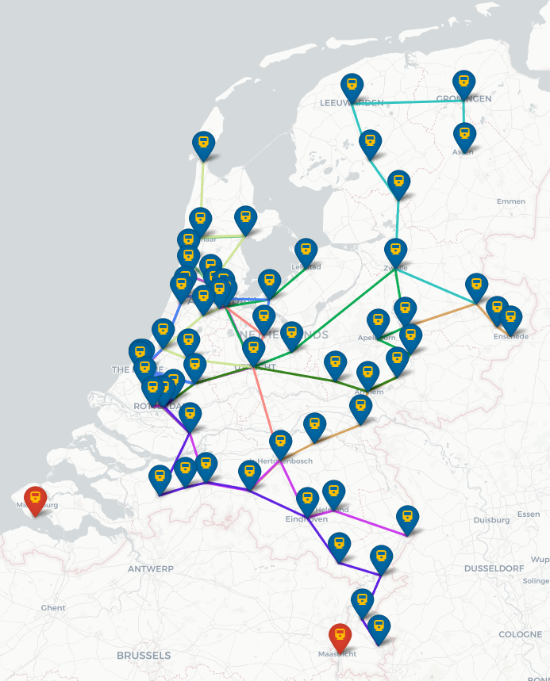

# Visualisation

Deze folder bevat twee bestanden om visualisaties mee te maken.

## visualise.py

Geef als input een Graph, een Routemap (oplossing na een algoritme) en het gebruikte algoritme mee. De class TrainMap maakt dan vervolgens een interactieve visualisatie in de vorm van een html bestand. Dat ziet er ongeveer zo uit:

Er kan geklikt worden op connecties en routes voor meer informatie. Elke route heeft een eigen kleur, zodat bekeken kan worden hoe de gemaakte routes door Nederland lopen.

## scores.py

Deze functies dragen niet bij aan de algoritmen of de case in het algemeen, maar ze zijn door ons gebruikt om resultaten te genereren voor de milestones.