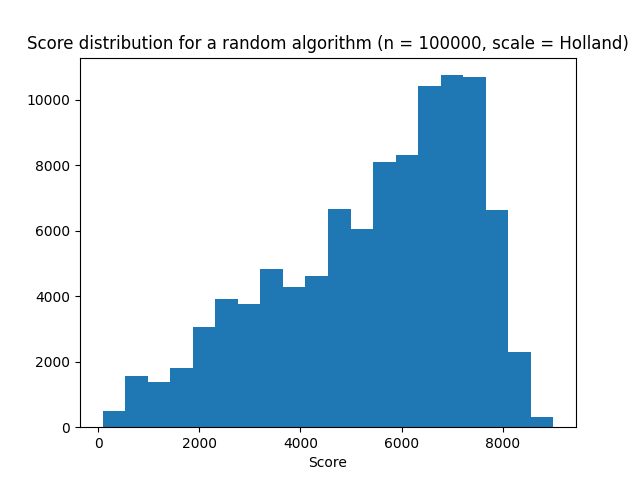

# Baseline
Onze random baseline dient om resultaten van algoritmes te kunnen vergelijken. 

## Pseudocode algoritme
Het random algoritme werkt als volgt:

```
def random_solution(graph):
    initialize routemap
    pick random number of routes N

    for each N do
        initialize route
        initialize candidates with distance 0

        while candidates
            add random station to route
            candidates = []
            for each neighbor of picked station do
                if neigbor not visited and does not exceed total time
                    add neighbor, distance to neighbor to candidates

        add route to routemap
```
<div style="page-break-after: always;"></div>

## Resultaten algoritme




Het algoritme scoort een stuk beter op Noord- en Zuid-Holland dan op geheel Nederland. Dit komt waarschijnlijk doordat Noord- en Zuid-Holland in totaal een stuk minder connecties bevatten dan heel Nederland, waardoor de fractie gereden verbindingen al gauw wat beter is. 
We zien in beide histogrammen een 'left skewed' distributie. Waarom zijn er wel (hele) lage scores maar zijn de scores vaak niet veel hoger dan de modus?

### Verklaring scores
- Het algoritme doet geen poging om zoveel mogelijk connecties te berijden, waardoor p (fractie bereden connecties) laag ligt en scores vaker laag uitvallen
- Het algoritme vult routes totdat het maximum aantal minuten is bereikt, waardoor er wellicht onnodig connecties in meerdere trajecten voorkomen. Het totaal aantal minuten (Min in de formule) valt zo erg hoog uit
- Het algoritme kiest een willekeurig aantal trajecten waardoor er soms maar weinig routes worden toegevoegd. Hoewel het lagere aantal trajecten meer punten oplevert, resulteert dit vaak ook weer in een kleine fractie bereden connecties. In de volgende plot is deze trade-off mooi te zien:

