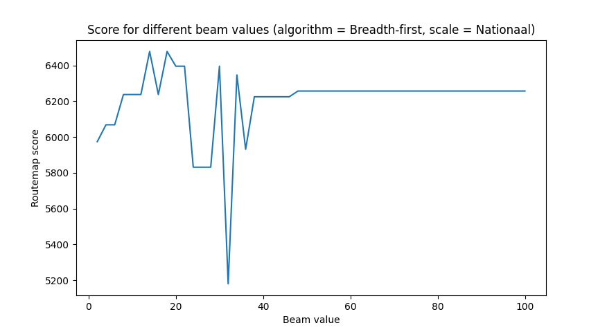
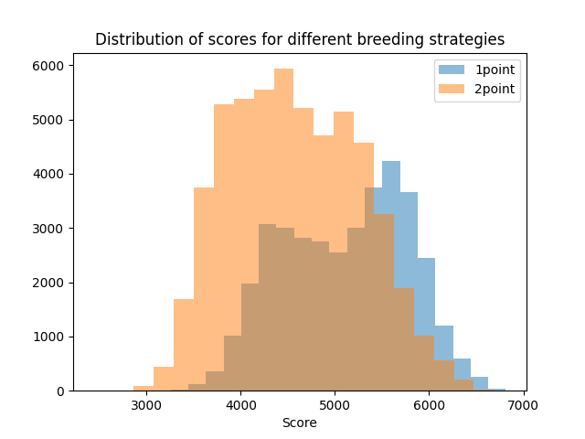
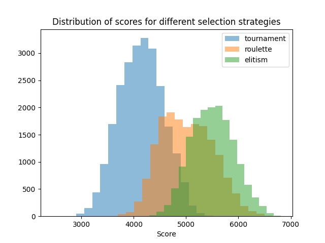
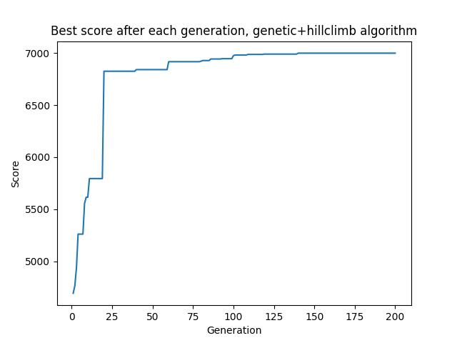

# Experiment

Voor deze milestone hebben we al onze gemaakte algoritmes met elkaar vergeleken. Een aantal algoritmes hebben verschillende configuraties, ook deze zijn met elkaar vergeleken.

### Methode

We hebben de code in `experiment.py` gedraaid voor alle verschillende algoritmes. Dit geldt voor random, breadth first, hillclimber en genetic. Op de volgende manier kun je het experiment draaien:

```
python experiment.py -s (--scale) -a (--algorithm)
```

Bijvoorbeeld:

```
python experiment.py -s Nationaal -a random
```

Het script geeft voor elk algoritme een csv bestand als output. Met de verzamelde data zijn de volgende resultaten verkregen.

## Random

Het random algoritme is 100.000 keer gedraaid. Daar kwam de volgende distributie van scores uit:


De beste score die het random algoritme heeft behaald is een score van 6151.842696629214, maar de gemiddelde score is 3570.795190224718. Het algoritme kan toevallig een goede score halen, maar haalt dit meestal dus niet.

## Greedy

Ons greedy algoritme is deterministisch, daarom hebben we deze niet vaker laten draaien. Het algoritme haalt een score van 6316.483146067416 op Nationaal.

## Breadth first

Het breadth first algoritme is deterministisch, er zal dus altijd hetzelfde resultaat uit komen. We hebben het algoritme gedraaid met verschillende beam scores.



Aangezien de score het hoogste lijkt te liggen tussen een beam waarde van 10 en 20, hebben we deze resultaten nog nader bekeken. Onderstaande tabel laat zien dat een beam waarde van 14 of 18 de beste score oplevert.

| Beam waarde  | Score     |
|--------------|-----------|
| 10 | 6237.247191011236   | 
| 12 | 6237.247191011236   | 
| 14 | 6477.966292134832   |
| 16 | 6237.247191011236   |
| 18 | 6477.966292134832   |
| 20 | 6395.606741573034   |

Het algoritme behaalt als beste score 6477.966292134832 bij een beam-waarde van 14 of 18.

## Hillclimber

Het hillclimber algoritme is geïmplementeerd met restart. Ook kan er ingesteld worden hoe vaak er per route een nieuwe random route wordt gegenereerd (r-waarde). We hebben getest met 1, 5, 10 en 20 restarts en een r-waarde van 100, 500 en 1000. Elke optie heeft een minuut gekregen om zo vaak mogelijk te draaien.

| Restarts, R-value | Runs             |   Mean score        |   Lowest score     |   Highest score    |
|:-----------       |-----------------:|--------------------:|-------------------:|-------------------:|
| (1, 100)          |              735 |             5097.16 |            1069.31 |            6460.28 |
| (1, 500)          |              153 |             5462.57 |            1186.67 |            6665.2  |
| (1, 1000)         |               69 |             5514.04 |            1299.03 |            6735.92 |
| (5, 100)          |              130 |             5566.26 |            1185.67 |            6730.2  |
| (5, 500)          |               31 |             5395.98 |            1299.03 |            6881.28 |
| (5, 1000)         |               16 |             5691.56 |            1314.03 |            6882.28 |
| (10, 100)         |               79 |             5573.38 |            1297.03 |            6825.56 |
| (10, 500)         |               13 |             5851.98 |            2708.43 |            6760.64 |
| (10, 1000)        |                8 |             5699.03 |            2600.07 |            6797.64 |
| (20, 100)         |               32 |             6273.27 |            4765.42 |            6776.28 |
| (20, 500)         |                7 |             6526.14 |            5883.09 |            6840.92 |
| (20, 1000)        |                3 |             6458.18 |            6182.89 |            6939.64 |

Aangezien de laatste twee opties duidelijk het beste scoren, maar niet zo vaak hebben kunnen draaien hebben we deze nog wat extra tijd gegund. Beide opties hebben 5 minuten gekregen.

| Restarts, R-value |  Runs             |   Mean score        |   Lowest score     |   Highest score    |   Median score        |
|:-----------       |------------------:|--------------------:|-------------------:|-------------------:|----------------------:|
| (20, 500)         |                34 |             5556    |            1412.39 |            6958.64 |               6312.5  |
| (20, 1000)        |                21 |             5160.93 |            1520.75 |            6851.64 |               6138.53 |

Zoals te zien is het hillclimbing algoritme niet altijd even betrouwbaar in het vinden van een goede oplossing, omdat het standaard met een random valide oplossing start. Als deze random oplossing bijvoorbeeld bestaat uit maar één route, komt er nooit een hele goede oplossing uit. Maar als de route wel aardig is, heeft het hillclimbing algoritme heel veel potentie op hoge scores, met een hoogste score van 6958.64. Ook hebben we de mediaan toegevoegd, omdat dit wellicht een beter beeld geeft van de scores dan het gemiddelde, aangezien er soms één hele lage score bij zit.

## Genetic

Het genetisch algoritme kent ontzettend veel opties. We hebben al deze opties een minuut gegeven om zo vaak mogelijk te draaien. Er waren in totaal 324 configuraties. Hieronder staan de vijf beste configuraties:

| Breeding, selection, generations, mutate rate, population size  | Runs |    Mean score |     Lowest score |     Highest score |   Median score |
|:------------------------------------------------------|---------|------:|--------:|--------:|---------:|
| ('1point', 'elitism', 200, 0.2, 500)                  |      31 | 6475.75 | 6227.56 | 6814.92 |  6478.64 |
| ('1point', 'elitism', 200, 0.4, 1000)                 |      15 | 6562.88 | 6319    | 6773.28 |  6586    |
| ('1point', 'elitism', 200, 0.4, 500)                  |      30 | 6460.1  | 6273.64 | 6728.28 |  6464.46 |
| ('1point', 'elitism', 200, 0.2, 1000)                 |      15 | 6537.28 | 6350.64 | 6717.28 |  6543.28 |
| ('1point', 'elitism', 200, 0.6, 500)                  |      29 | 6415.58 | 6115.28 | 6691.64 |  6429.64 |

Uit deze resultaten blijkt dat 1-point breeding en elitism selection in combinatie met 200 generaties het beste lijkt te werken. In de milestone van ons tweede algoritme is dit ook al gebleken. Zie onderstaande grafieken met het verloop van de score in de verschillende generations.

 

Hieronder de scoreverdeling per selectie- en breeding strategie.

 

Tijd om deze configuratie nog wat beter te testen. Voor de mutatation rates 0.2, 0.4 en 0.6 draaien we elke configuratie 10 minuten met een grotere populatie: 10.000.

| Breeding, selection, generations, mutate rate, population size  |     Mean score |     Lowest score |     Highest score |   Median score |
|:---------------------------------------|--------:|--------:|--------:|---------:|
| ('1point', 'elitism', 200, 0.4, 10000) | 6777.55 | 6605.64 | 6884.92 |  6800    |
| ('1point', 'elitism', 200, 0.2, 10000) | 6772.85 | 6673    | 6881.64 |  6749.14 |
| ('1point', 'elitism', 200, 0.6, 10000) | 6640.32 | 6488.64 | 6879    |  6646.64 |

We zien dat het algoritme ontzettend constant scoort, tussen de +- 6500 en 6900. De hogere populatie zorgt voor iets hogere scores.

## Genetic + hillclimber

We kunnen ook een combinatie van een genetisch algoritme en het hillclimber algoritme testen. In plaats van random mutaties wordt er 10% van de generaties gemuteerd volgens door de oplossingen te hillclimben. Hiervoor moeten we wel een wat lagere mutatiekans (5%) kiezen om tijdsredenen. We kiezen wederom 1-point breeding en elitism selection met 200 generaties. We draaien het algoritme 8 keer handmatig.

| Run | Score        |
|----:|-------------:|
|   1 |  7062        |
|   2 |  7025.64     |
|   3 |  6990        |
|   4 |  7070        |
|   5 |  7037        |
|   6 |  7065.64     |
|   7 |  6995        |
|   8 |  6942        |

Hieronder het verloop van een genetic + hillclimber run. Hierin is goed te zien hoe hillclimber het resultaat snel omhoog weet te brengen.



## Vergelijk van alle algoritmen

| Algoritme (beste configuratie)  |  Mean score  |  Highest score  |
|:--------------------------------|-------------:|----------------:|
| Random                          |  3570.79     |  6151.84        |
| Greedy                          |  6316.48     |  6316.48        |
| Breadth first (beam=14)         |  6477.97     |  6477.96        |
| Hillclimber (r=500, restarts=20)|  5556        |  6958.64        |
| Genetic                         |  6777.55     |  6884.92        |   
| Genetic + hillclimber           |  7023.41     |  7070           |