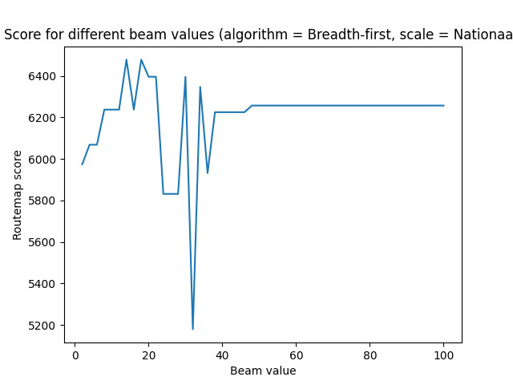
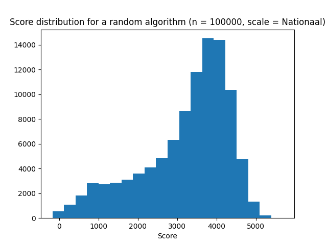

# Eerste algoritme
Als eerste algoritme hebben we een breadth first algoritme geïmplementeerd met beam search.

## Pseudocode
```
def breadth_first(graph):
    initialize routemap

    while improvements and not max routes reached

        for every station, initialize route with start station

        while options
            for every option (route)
                get new candidates for route
                for every candidate, measure increase

            options = top x candidates
        
        add most increasing route to routemap
```

<div style="page-break-after: always;"></div>

## Resultaten

We hebben ons algoritme gedraaid met beam waarden tussen de 2 en 100. Hieronder een plot van de scores:



Aangezien de score het hoogste lijkt te liggen tussen een beam waarde van 10 en 20, hebben we deze resultaten nog nader bekeken. Onderstaande tabel laat zien dat een beam waarde van 14 of 18 de beste score oplevert.

| Beam waarde  | Score     |
|--------------|-----------|
| 10 | 6237.247191011236  | 
| 12 | 6237.247191011236  | 
| 14 | 6477.966292134832  |
| 16 | 6237.247191011236  |
| 18 | 6477.966292134832  |
| 20 | 6395.606741573034  |

<div style="page-break-after: always;"></div>

## Vergelijking met baseline



We zien dat onze random scores op het nationale treinnetwerk meestal een score tussen de 3000 en 4000 oplevert. In het beste geval behaalt het random algoritme een score van net iets boven de 5000. Aangezien ons breadth first algoritme in het beste geval een score van 6478 haalt, kunnen we stellen dat dit een flinke verbetering is ten opzichte van de baseline. Zelfs met beam waardes waarbij de score lager ligt, scoort het algoritme beter dan de baseline in alle gevallen.