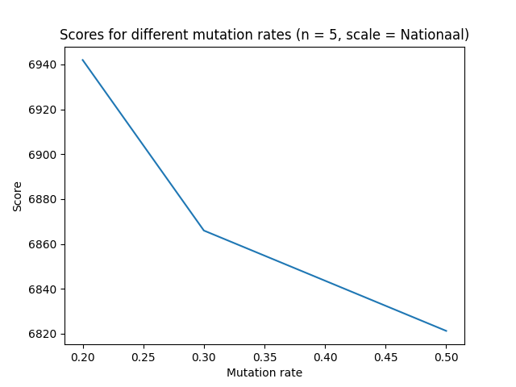

# Eerste algoritme
Als tweede algoritme hebben we een genetisch algoritme geïmplementeerd, inclusief een heel aantal verschillende variaties.

## Pseudocode
```
def genetic(graph):
    create n random routes
    population = create m random combinations of routes

    for every generation:

        select(population) (standard the best half of population)
        crossover(population)
        mutate(population)
        calculate fitness score for every chromosome in population

    create routemap from best chromosome in population
```

<div style="page-break-after: always;"></div>

## Resultaten

Ons algoritme heeft veel verschillende opties.
- generations: the number of times to repeat the selection, crossover and mutation phase
- genes_size: the number of different random genes (routes) to generate
- population_size: the number of different combinations of genes to generate a population
- mutation_rate: the chance for mutation to happen, 0.2 means 20% chance of mutation
- use_hillcimber: boolean if hillclimber should be used in mutation phase
- selection_strat: the selection strategy (options = 'elitism', 'rws', 'tournament')
- breeding_strat: the breeding strategy (options = '1point', '2point', 'uniform')

Voor de generations, genes_size en population_size geldt: hoe hoger de waarde, hoe beter de resultaten worden. De kans dat een goede oplossing wordt gekozen wordt alleen maar groter wanneer er meer routes worden gegenereerd, of er meer combinaties aan routes worden gekozen. Dit gaat uiteraard gepaard met een lange runtime, maar een population_size en genes_size van 10000 en 200 generations lijkt een goede sweet-spot.

### Mutation rate

Allereerst hebben we gekeken naar een goede waarde voor de mutation rate. Na een test met een populatie van 1000 hebben we ingezoomd op mutatiekansen van 20, 30, 40 en 50%. Hogere mutatiekansen werden te willekeurig, waardoor vaak goede oplossingen juist slechter werden door de hoge mutatiekans. We hebben het genetisch algoritme vijf keer uitgevoerd voor elke kans en het beste resultaat gepakt.



### Selection strategie

We hebben drie verschillende selectie-strategieën uitgewerkt. Elke selectiestrategie is vijf keer uitgevoerd op een populatie van 10000 en 200 generaties. De beste oplossing is weergegeven.


### Breeding strategie

We hebben drie verschillende breeding-strategieën uitgewerkt. Elke breedingstrategie is vijf keer uitgevoerd op een populatie van 10000 en 200 generaties. De beste oplossing is weergegeven.


### Combinatie met hillclimber

We zijn bezig met hillclimber. We halen resultaten boven de 7000, wat betekent dat dit onze beste optie tot nu toe is. We hebben nog wat meer tijd nodig voor uitvoerige tests.

<div style="page-break-after: always;"></div>

## Vergelijking met baseline


We zien dat onze random scores op het nationale treinnetwerk meestal een score tussen de 3000 en 4000 oplevert. In het beste geval behaalt het random algoritme een score van net iets boven de 5000. Aangezien ons genetisch algoritme veelal boven de 6500 scoort bij goede configuraties, kunnen we stellen dat dit een flinke verbetering is ten opzichte van de baseline. Ook lijkt het algoritme beter te scoren dan het deterministische breadth-first algoritme (score van 6478).