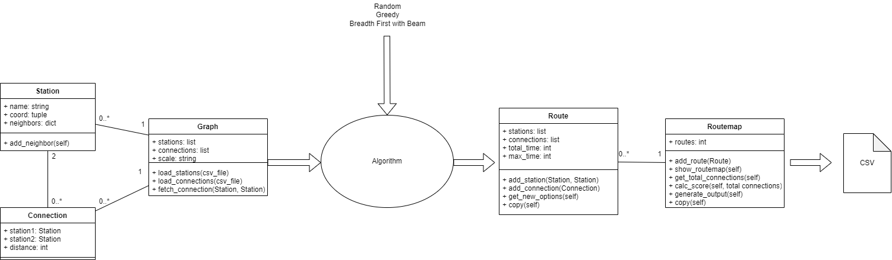

# Classes

Deze folder bevat alle verschillende classes die nodig zijn voor het draaien van de code. De classes houden op de volgende manier verband met elkaar:

## Station

Een Station object representeert een station.

Attributen:
- Naam (string): de naam van het station
- Coördinaten (tuple met floats): de coördinaten die de locatie van het station aangeven
- Neighbors (list): een lijst met aangrenzende stations en de afstand naar die stations

Functies:
- add_neighbor: voegt een buur toe aan het station, dit gebeurt bij het vullen van een Graph

## Connection

Een Connection object reprenteert een verbinding tussen twee stations.

Attributen:
- Station 1 (object): het eerste station van de connectie
- Station 2 (object): het tweede station van de connectie
- Distance (int): de afstand (in minuten) tussen de twee stations

## Graph

Een Graph object representeert het gehele treinnetwerk, bestaande uit Station en Connection objecten. Een graph is de input van een algoritme.

Attributen:
- total_connections (int): het totaal aantal connecties in de gehele graph
- Stations (list met objecten): een lijst met stations in de graph
- Connections (list met objecten): een lijst met connecties in de graph
- Scale (string): de schaal van de Graph, Holland of Nationaal
- MAX_TIME, MAX_ROUTES: gebaseerd op de schaal, geven de constraints van maximale tijd en routes aan

Functies:
- get_constants: haal de constante waarden MAX_TIME en MAX_ROUTES op op basis van de schaal
- load_stations: laadt stations uit een csv file in de graph
- load_connections: laadt connecties uit een csv file in de graph
- fetch_connection: heeft als input twee station, geeft het originele connectieobject tussen deze stations terug

## Route

Een Route object representeert een traject. Het bestaat uit Station en Connection objecten.

Attributen:
- Stations (list met objecten): een lijst met stations in de route (op volgorde!)
- Connections (list met objecten): een lijst met connecties in de route
- Total time (int): totale tijd die deze route in beslag neemt
- Max time (int): maximale tijd die deze route in beslag mag nemen

Functies:
- add_station: voegt een station object toe aan de route (op de goede plek in de route)
- add_connection: voegt een connection object toe aan de route
- get_new_option: genereert nieuwe opties om toe te voegen voor de huidige route op basis van de lijst van stations
- copy: maakt een kopie van het huidige object

## Routemap

Een Routemap object representeert een lijnvoering. Het bestaat uit Route objecten. Het is de output van een algoritme.

Attributen:
- Routes (list met objecten): een lijst met Route objecten

Functies:
- add_route/add_routes: voegt een route/routes object(en) toe aan de lijnvoering
- replace_route: vervangt een route voor een nieuwe route
- get_total_connections: haalt het aantal unieke connecties in de gehele lijnvoering op, gebruikt in calc_score
- calc_score: berekent de score (kwaliteit) van een lijnvoering
- generate_output: genereert een csv bestand met de resultaten van de routemap
- copy: maakt een kopie van het huidige object

